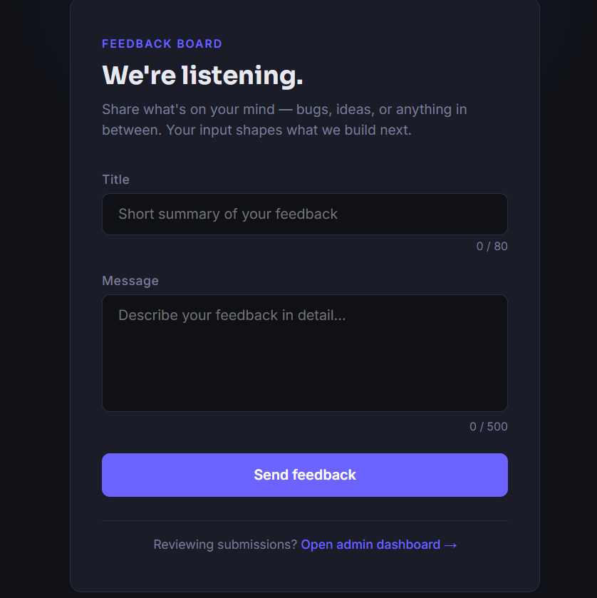
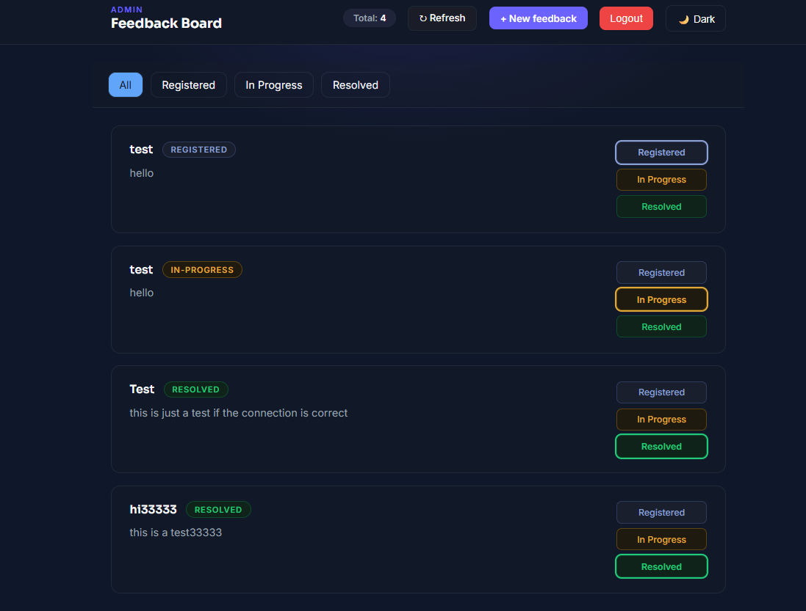
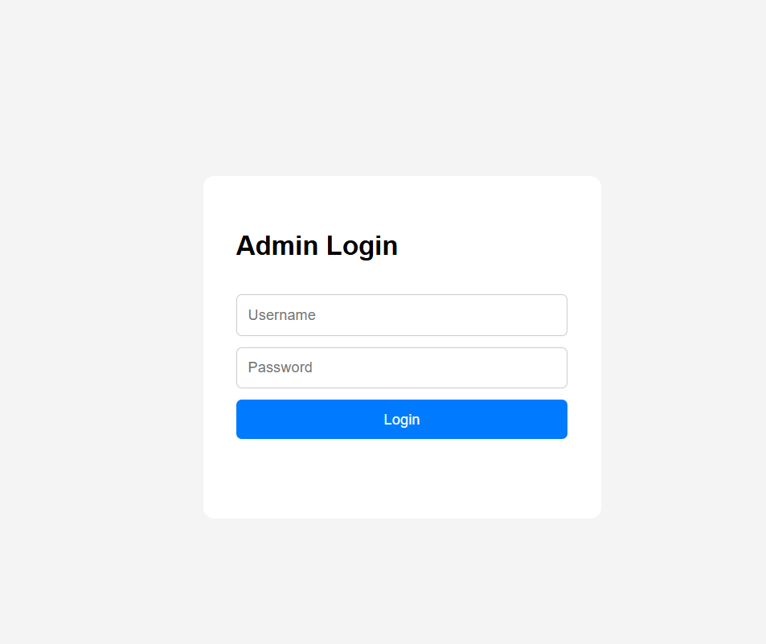

# 📌 Feedback Board (Mini Full-Stack Project)

A simple full-stack feedback management system built with **Node.js (Express)** and a **vanilla HTML/CSS/JS frontend**.
This project demonstrates basic CRUD operations, API integration, and a simple admin dashboard.

---

## 🚀 Features

### 🟢 User Side

- Submit feedback with title and message
- Send data to backend via REST API (POST request)
- Clean and simple UI

### 🟡 Admin Dashboard

- View all submitted feedbacks
- See feedback status:
  - Registered
  - In Progress
  - Resolved

- Update feedback status dynamically (PUT request)
- Real-time UI update after changes

---

## 🧰 Tech Stack

### Backend

- Node.js
- Express.js
- REST API

### Frontend

- HTML5
- CSS3
- Vanilla JavaScript (Fetch API)

---

## 📁 Project Structure

feedback-board/
│ ├── index.html
│ ├── user.html
│ ├── admin.html
│ ├── login.html
│ ├── style/
│ │ ├── style-user.css
│ │ └── style-admin.css
│ │ ├── style-login.css
│ ├── js/
│ │ ├── user.js
│ │ └── admin.js
│ │ └── login.js

````

---

## ⚙️ How to Run the Project Locally

### 1. Clone the repository

```bash
git clone https://github.com/MahdMsv/Feedback-dashboard.git
````

---

### 2. Run Backend

Backend will run on:

```
http://localhost:3000
```

---

### 3. Run Frontend

Simply open the HTML files in your browser:

- `frontend/user.html` → User page
- `frontend/admin.html` → Admin dashboard

💡 Tip: You can use **VS Code Live Server** for better experience.

---

## 🔌 API Endpoints

### 📥 Get all Feedbacks

```
GET /feedbacks
```

### ➕ Create feedback

```
POST /feedbacks
```

**Body:**

```json
{
  "title": "Example title",
  "message": "Example message"
}
```

### 🔄 Update feedback status

```
PUT /feedbacks/:id
```

**Body:**

```json
{
  "status": "in-progress"
}
```

---

## 📌 Status Types

- `registered` → Default when feedback is created
- `in-progress` → Under review
- `resolved` → Completed

---

## 💡 What I Learned

- Building REST APIs with Express
- Handling frontend-backend communication using Fetch API
- Structuring a simple full-stack project
- Basic CRUD operations
- Separating frontend concerns into multiple pages

---

## 📸 Screenshots

### 🟢 User Page



### 🟡 Admin Dashboard



### 🔐 Login Page



---

## 🔐 Authentication & Admin Access

A simple login system has been implemented for admin access.

- Admin login is required to access the dashboard
- Default admin password: `1234`
- Only authenticated admin users can update feedback status
- User authentication helps restrict access to sensitive operations
- Admin can change feedback status (Registered / In Progress / Resolved)

---

## 👨‍💻 Builder

- Name: Mahdi Mousavi
- GitHub: https://github.com/MahdMsv
